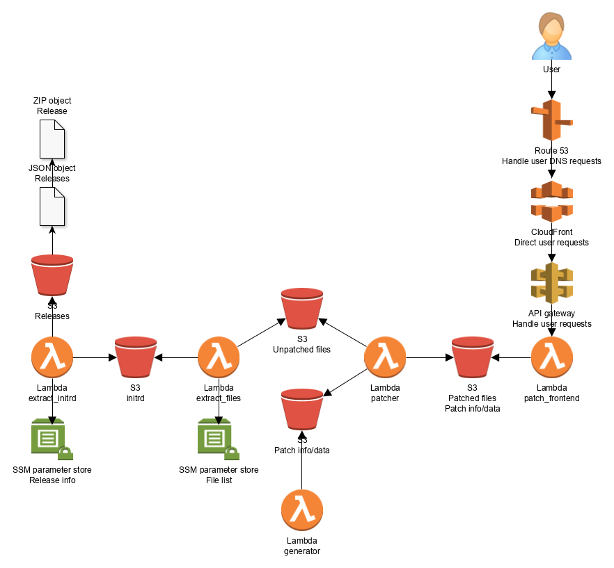

# mythic-raider-lambda

Python code for parts of an old AWS Lambda "pipeline" where the purpose, in order, is to:
1. `extract_initrd.py` will scan a public S3 bucket, stream a ZIP file and extract a specific file from it with `libarchive` and upload it to a private S3 bucket
2. `extract_files.py` will then be triggered, to extract some files from the CPIO archive that was extracted by the previous function, once again by streaming the file to `libarchive` and upload the files to anotherp rivate S3 bucket
3. `app.py` will byte patch the extracted files with our data, once again putting the data in yet another S3 bucket

Separate from these, `generator.py` is used to generate the data `app.py` will use to patch the files with

Architecture diagram that should represent how the code was deployed at one point:

